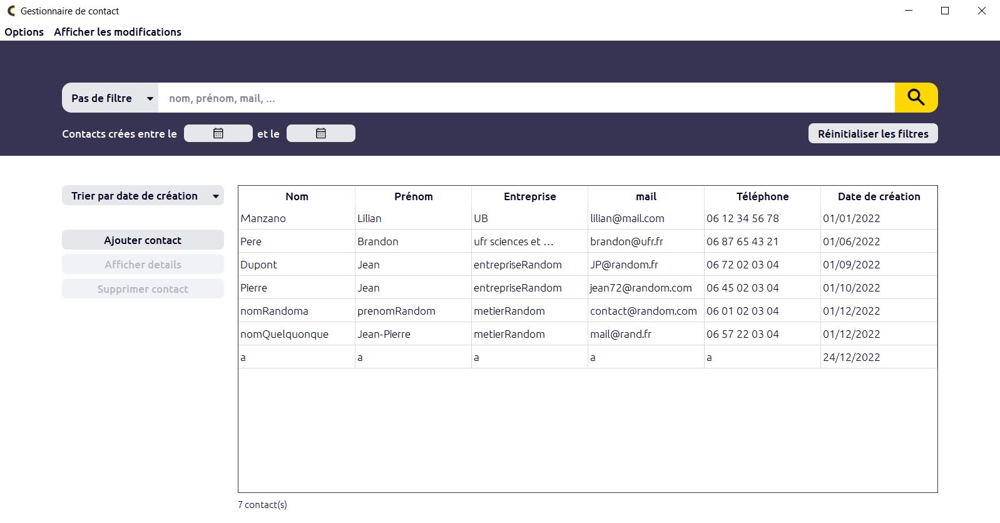

# Project

It's an application allowing the creation and management of contacts, as well as the addition of notes to them.



This project was made for a 3rd year license study project.


### Features 

- Addition, modification, and deletion of contacts with different information (last name, first name, email, photo, ...).
- Adding, editing, and deleting notes to these contacts.
- Adding, modifying, and deleting tags to these notes. '@todo' allows to remind something to do (call, meeting, ...), and '@date' allows to indicate the date of the first tag.
- Search for contacts by different filters or by their tags.
- View the history of changes made to all contacts or to a specific contact.
- Export of data (excluding history) in JSON format.

# Built with 

The project is made in C++ with [Qt](https://www.qt.io/ ""), and for the database we use [SQLite](https://www.sqlite.org/index.html "").

# Get and use project

### Prerequisites


### Installation 

1. Clone the repo. 
```
git clone https://github.com/LilianLeVrai/Contact_manager.git
```


# Documentation

The code is commented with [Doxygen](https://www.doxygen.nl/ ""), so you can generate the HTML documentation using the doxyfile present in the 'docs' folder. Moreover in this folder you can find diagrams and reports documenting the project. 
This project being intended for a French professor, all this documentation is in French.

# Contributors 

- [Lilian M.](https://github.com/LilianLeVrai "")
- [Brandon P.](https://github.com/Branedon "")

